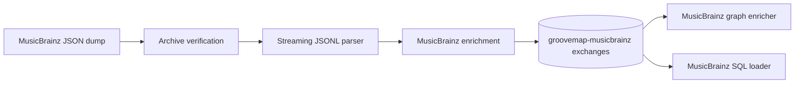

# GrooveMap MusicBrainz ingestion

`musicbrainz-ingestion` downloads MusicBrainz JSON dumps, verifies and extracts the
archives, enriches JSONL records, and publishes versioned events to RabbitMQ. This
repository owns the MusicBrainz producer, its event contract, generated bindings,
fixtures, state markers, container image, tests, and release artifacts.



The service publishes artists, labels, release groups, and releases. It is an
independent runtime: it does not poll Discogs health, acquire a cross-container lock,
or wait for Discogs ingestion. The two provider containers may ingest concurrently.

## Development

```bash
mise install
just setup
just check
```

Use `just contract` after changing `contracts/catalog-events/definitions/musicbrainz.json`.
`just image` builds `musicbrainz-ingestion:local`; `just release-dry-run` prepares local
release evidence without publishing, tagging, or pushing.

See the [documentation index](docs/README.md) and the [contract guide](contracts/catalog-events/README.md).
The project is licensed under the [MIT License](LICENSE).
