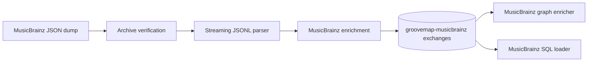

# GrooveMap MusicBrainz ingestion

`musicbrainz-ingestion` downloads MusicBrainz JSON dumps, verifies and extracts the
archives, enriches JSONL records, and publishes versioned events to RabbitMQ. This
repository owns the MusicBrainz producer, its event contract, generated bindings,
fixtures, state markers, container image, tests, and release artifacts.



The service publishes artists, labels, release groups, and releases. It is an
independent runtime: it does not poll Discogs health, acquire a cross-container lock,
or wait for Discogs ingestion. The two provider containers may ingest concurrently.

## Telemetry

The extractor pushes OpenTelemetry metrics over **OTLP/HTTP-protobuf** to the collector.
There is no Prometheus scrape endpoint for these metrics, and the JSON `/health`,
`/metrics`, `/ready`, and `/trigger` endpoints are unchanged — they remain part of the
ADR-0005 HTTP contract. Only standard OTEL environment variables are read; there are no
GrooveMap-specific telemetry variables.

| Variable | Effect |
| --- | --- |
| `OTEL_EXPORTER_OTLP_ENDPOINT` | Collector base URL, e.g. `http://otel-collector:4318`. **Unset disables metrics entirely.** |
| `OTEL_EXPORTER_OTLP_METRICS_ENDPOINT` | Per-signal override of the base URL. |
| `OTEL_METRICS_EXPORTER` | `otlp` (default) or `none` to disable export. |
| `OTEL_SERVICE_NAME` | `service.name`; the compose service key, e.g. `extractor-musicbrainz`. Defaults to `musicbrainz-ingestion`. |
| `OTEL_RESOURCE_ATTRIBUTES` | Extra resource attributes, e.g. `service.namespace=groovemap,deployment.environment.name=dev`. |
| `OTEL_METRIC_EXPORT_INTERVAL` | Export period in milliseconds; the SDK default is 60000. |

`service.version` is always set from the crate version. The `source` attribute on every
domain metric is the constant `musicbrainz` — this repository owns exactly one provider.

Telemetry never fails startup: with no endpoint configured the bootstrap logs once and
installs a no-op meter provider. Export runs on a periodic reader off the extraction path,
and the final export is flushed on shutdown.

Instruments emitted:

| Instrument | Kind | Attributes |
| --- | --- | --- |
| `groovemap.extraction.records` | counter | `source`, `entity` |
| `groovemap.extraction.files` | counter | `source`, `outcome` |
| `groovemap.extraction.file.progress` | gauge (0..1) | `source`, `entity` |
| `groovemap.extraction.download.bytes` | counter (`By`) | `source` |
| `groovemap.extraction.publish.confirm.duration` | histogram (`s`) | `source` |
| `groovemap.extraction.errors` | counter | `source`, `stage` |
| `messaging.client.sent.messages` | counter | `messaging.system`, `messaging.destination.name` |
| `groovemap.pipeline.reconnects` | counter | `system` |

## Development

```bash
mise install
just setup
just check
```

Use `just contract` after changing `contracts/catalog-events/definitions/musicbrainz.json`.
`just image` builds `musicbrainz-ingestion:local`; `just release-dry-run` prepares local
release evidence without publishing, tagging, or pushing.

`just image` is not part of `just check`; it is the container build gate. Run it yourself
whenever you touch a compile-time include (such as `include_str!`/`include_bytes!` targets
under `contracts/`) to confirm the Dockerfile still copies what the build needs — the
reusable CI workflow builds the image on every push, but that feedback arrives after `just
check` has already passed locally.

### Compiler cache

Builds run `rustc` through [sccache](https://github.com/mozilla/sccache).
`just bootstrap` installs it with the other mise-managed tools, and
`.cargo/config.toml` sets `rustc-wrapper = "sccache"`, so every local `cargo`
invocation reuses previously compiled objects.

Locally the cache lives in sccache's default directory, `~/.cache/sccache` on
Linux and `~/Library/Caches/Mozilla.sccache` on macOS; set `SCCACHE_DIR` to move
it. Inside the image the cache lives at `/root/.cache/sccache`, backed by the
BuildKit cache mount `sccache-musicbrainz-ingestion`, so a second `just image`
reuses the first build's objects.

```bash
sccache --show-stats
```

Set `RUSTC_WRAPPER` to the empty string to build without the cache:

```bash
RUSTC_WRAPPER= just check
```

See the [documentation index](docs/README.md) and the [contract guide](contracts/catalog-events/README.md).
The project is licensed under the [MIT License](LICENSE).
