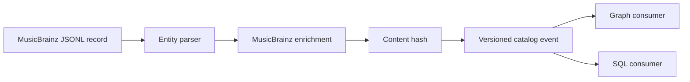

# ADR 0001: Finalize MusicBrainz payloads at the producer boundary

- Status: accepted
- Scope: MusicBrainz event payloads

## Context

MusicBrainz JSONL is source-shaped data. GrooveMap events add cross-reference and media
fields and require a content hash that represents exactly what consumers receive. If
consumers independently add those fields or recompute the hash, their projections can
diverge.

## Decision

Each MusicBrainz entity parser constructs the final `data` payload and computes `sha256`
immediately before creating its `DataMessage`. Release media mapping and MusicBrainz URL
cross-reference enrichment therefore occur before hashing. The producer does not expose a
general-purpose rule engine or a second source mode.

## Consequences

- Consumers perform storage-specific projection rather than rebuilding producer fields.
- The hash covers the published MusicBrainz payload, including derived media fields.
- Changing parsing or enrichment can change hashes and requires contract compatibility
  review and an idempotent consumer rollout.
- Provider-neutral mechanisms may share local interfaces, but MusicBrainz acquisition,
  parsing, mapping, and orchestration remain owned here.
