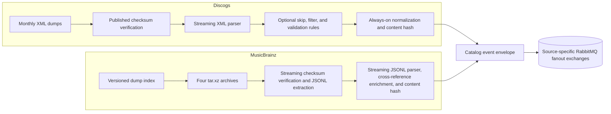

# Extraction architecture

The `extractor` binary supports two source modes. Each mode owns source acquisition,
parsing, state tracking, and publication to source-specific RabbitMQ fanout exchanges.
Consumers are deliberately outside this repository; they depend on the versioned
[catalog event contract](../contracts/catalog-events/README.md), not on producer source.

Select a mode with `--source discogs|musicbrainz` or `EXTRACTOR_SOURCE`. The default is
Discogs.

The binary composition root now enters explicit `discogs` or `musicbrainz` modules.
Those modules own provider acquisition, parsing, transformation, and orchestration.
Only batching, AMQP publication, health/trigger state, marker persistence, polite HTTP,
and shutdown mechanics remain provider-neutral runtime services. The legacy
`extractor` module is an exports-only compatibility surface.

## Discogs

Discogs mode discovers the newest monthly artists, labels, masters, and releases dumps.
It downloads missing or changed files, verifies their bytes against the upstream
`CHECKSUM` file when available, and persists download metadata after each file.

Parsed XML records may pass through the optional [extraction rules
pipeline](extraction-rules-guide.md). Regardless of whether rules are enabled, every
published Discogs record passes through the producer normalizer and receives a SHA-256
content hash computed from the normalized payload. See the [normalization
decision](decisions/0001-producer-normalization-boundary.md).

## MusicBrainz

MusicBrainz mode discovers the latest `YYYYMMDD-HHMMSS` directory at the configured dump
URL. For each entity it streams the `.tar.xz` response through SHA-256 verification,
extracts only the expected `mbdump/<entity>` entry, recompresses it as `.jsonl.xz`, and
atomically exposes the final file only after verification succeeds. Partial `.tmp` files
are never treated as complete.

The four downloaded entities are artist, label, release-group, and release. A first pass
over artists builds an MBID-to-Discogs-ID map used to enrich artist relationship targets.
Entity-level Discogs URL relations become these optional cross-reference fields:

| MusicBrainz entity | Published cross-reference |
| --- | --- |
| artist | `discogs_artist_id` |
| label | `discogs_label_id` |
| release group | `discogs_master_id` |
| release | `discogs_release_id` |

Records without a Discogs cross-reference are still published. Storage and graph
selection policies belong to consumer repositories.

Each of the four JSONL parsers (`parse_mb_artist_line`, `parse_mb_label_line`,
`parse_mb_release_line`, `parse_mb_release_group_line`) computes the published
record's SHA-256 content hash from its own final `data` payload, immediately before
constructing the `DataMessage` — the same `calculate_content_hash` used by Discogs'
normalizer (see the [normalization decision](decisions/0001-producer-normalization-boundary.md)).
No MusicBrainz record is published with an empty `sha256`.

`parse_mb_release_line` additionally publishes `media_raw`: the release's `media` array
as a position-ordered list of `{format, format_id, position, title, track_count}`
objects, keys always present (`null` when the source field is absent). This is a
verbatim, additive capture within contract v1 — MusicBrainz's per-medium `tracks` (and
`discs`) arrays are never emitted, and releases without media publish an empty list.
Mapping this raw medium data onto the project's own canonical media taxonomy is a
separate, later concern (see `contracts/` and its taxonomy decision records).

`MUSICBRAINZ_DUMP_URL` defaults to the MetaBrainz JSON dump index and
`MUSICBRAINZ_ROOT` defaults to `/musicbrainz-data`. `PERIODIC_CHECK_DAYS` controls how
often both source loops look for a newer version.

## Published entities

Exchange names follow `{prefix}-{entity}` and exchanges are fanout:

| Source | Default prefix | Entities |
| --- | --- | --- |
| Discogs | `groovemap-discogs` | `artists`, `labels`, `masters`, `releases` |
| MusicBrainz | `groovemap-musicbrainz` | `artists`, `labels`, `release-groups`, `releases` |

Override the prefixes with `DISCOGS_EXCHANGE_PREFIX` and
`MUSICBRAINZ_EXCHANGE_PREFIX`. The contract is authoritative for names and envelope
fields.

## Combined-runtime compatibility coordination

Before each initial, periodic, or manually triggered run, MusicBrainz waits while a
reachable, parseable Discogs health endpoint reports `running`. An unparseable response
fails open immediately; an unreachable endpoint fails open after ten attempts with
backoff. This prioritizes Discogs and normally reduces simultaneous peak load, but it is
not a publication-order guarantee or a distributed mutual-exclusion lock. The behavior
and failure trade-offs are recorded in the [Discogs-first coordination
decision](decisions/0002-discogs-first-musicbrainz-coordination.md).

That wait belongs only to the current combined-runtime compatibility layer on the
MusicBrainz path. It is not shared provider policy. Once Discogs and MusicBrainz run as
separate provider-owned containers, the compatibility layer is removed and both
containers may ingest concurrently without consulting each other's health endpoint.

## Health and triggers

Each process exposes the configured health port (default `8000`):

- `GET /health` — source progress and current extraction status.
- `GET /metrics` — machine-readable counters.
- `GET /ready` — readiness derived from extractor state.
- `POST /trigger` — request a run; `{"force_reprocess": true}` starts that run from a
  fresh in-memory marker which replaces the saved version state as work progresses.

Credentials, service URLs, mounted data roots, and container topology are deployment
concerns and must be supplied outside this repository.
