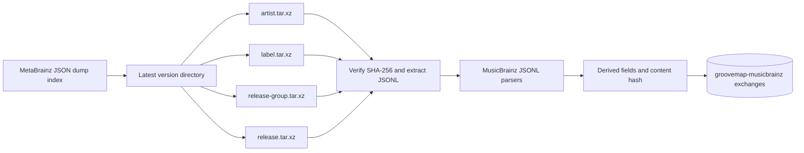

# MusicBrainz extraction

The `musicbrainz-ingestion` binary has one source: MusicBrainz. It discovers a dump
version, downloads and verifies the four JSON archives, parses their JSONL records, adds
MusicBrainz-specific derived fields, and publishes catalog events. There is no source
selection flag or extraction-rules configuration in this repository.

## Acquisition and restart behavior

`MUSICBRAINZ_DUMP_URL` defaults to the MetaBrainz JSON dump index and
`MUSICBRAINZ_ROOT` defaults to `/musicbrainz-data`. Versions use the upstream
`YYYYMMDD-HHMMSS` directory name. For each entity, the downloader streams the `.tar.xz`
response through SHA-256 verification, extracts only its expected `mbdump/<entity>`
entry, recompresses it as `.jsonl.xz`, and atomically exposes the final file after
verification. Partial `.tmp` files are not complete inputs.

The service checks for a newer version every `PERIODIC_CHECK_DAYS` days (default 15).
Pass `--force-reprocess` or set `FORCE_REPROCESS=true` to reprocess the selected version.
Otherwise the [state marker](state-marker-system.md) skips completed files and resumes an
incomplete version at file granularity.

## Parsing and enrichment

The published entities are `artists`, `labels`, `release-groups`, and `releases`. A first
artist pass builds an MBID-to-Discogs-ID map used only to enrich MusicBrainz relationship
targets. Entity URL relations may add `discogs_artist_id`, `discogs_label_id`,
`discogs_master_id`, or `discogs_release_id`; records without those cross-references are
still published.

Each parser computes `sha256` from its final `data` payload immediately before creating
the event. Release events additionally include:

- `country`, the release's ISO country code, or `null` when the dump carries none;
- `release_events`, an array of `{date, area_name, area_mbid}` built from the dump's raw
  `release-events`; an entry with neither a date nor an area carries nothing and is
  dropped;
- `catalog_numbers`, an array of `{catalog_number, label_mbid, label_name}` built from
  the dump's raw `label-info`; an entry without a catalogue number is dropped;
- `media_raw`, a source-order copy of MusicBrainz medium metadata without track arrays;
- `media`, the canonical block mapped with the vendored
  [`media-taxonomy.json`](../contracts/catalog-events/vocab/media-taxonomy.json).

A release without a country, release events, or catalogue numbers still emits `country`
as `null` and `release_events`/`catalog_numbers` as empty arrays — never a missing key —
and all three are computed before the content hash, so a change to any of them changes
`sha256`.

Unknown vocabulary values remain under `media.unmapped`. The mapping implementation is
`src/musicbrainz/media.rs`, and its conformance fixtures are under
`src/musicbrainz/tests/fixtures/media/`. See the [catalog event contract](../contracts/catalog-events/README.md)
for the generated event schema and fixture rules.

## Publication and HTTP control

The default RabbitMQ prefix is `groovemap-musicbrainz`, overrideable with
`MUSICBRAINZ_EXCHANGE_PREFIX`. Each entity has a fanout exchange named
`{prefix}-{entity}`. A successful file publishes `file_complete` before its marker is
made durable as completed; a successful version publishes `extraction_complete` only
after all four files succeed.

The process listens on `HEALTH_PORT` (default `8000`) and exposes:

- `GET /health` for lifecycle status and per-entity progress;
- `GET /metrics` for the legacy JSON counters;
- `GET /ready` for readiness;
- `POST /trigger` with optional `{"force_reprocess": true}` to request a run.

RabbitMQ credentials, service addresses, mounted data roots, and container topology are
deployment concerns. This repository does not require or coordinate another ingestion
producer.
