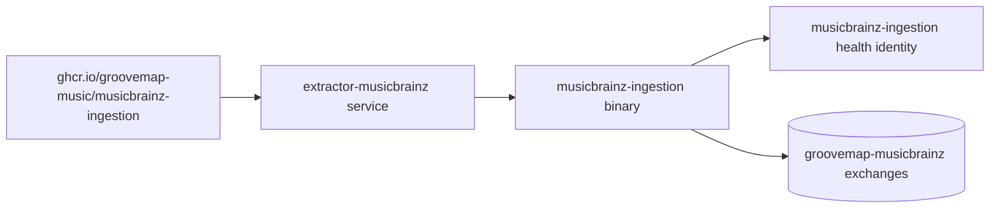

# Runtime identity and compatibility

The repository, package, executable, container image, health identity, startup banner,
and default OpenTelemetry service name all identify `musicbrainz-ingestion`. The Rust
library crate retains the internal name `extractor`. The deployment Compose service
remains `extractor-musicbrainz`, an addressable deployment interface.

## Retained compatibility identifiers

| Identifier | Boundary | Reason retained |
| --- | --- | --- |
| `extractor` | Rust library crate and internal module paths | Existing Rust imports and tests use this implementation name; it is not the executable or image identity. |
| `extractor-musicbrainz` | Deployment Compose service and network name | Deployment operations address the container by this stable service name. |
| `groovemap-musicbrainz-*` | RabbitMQ exchange names | These names are wire contracts consumed by MusicBrainz loaders and enrichers; the prefix remains configurable. |
| Discogs cross-reference fields | MusicBrainz event payloads | These fields record relationships declared by MusicBrainz data and do not select or invoke a Discogs producer. |

The independent Discogs producer has its own repository, image, process, state, and
release lifecycle.
