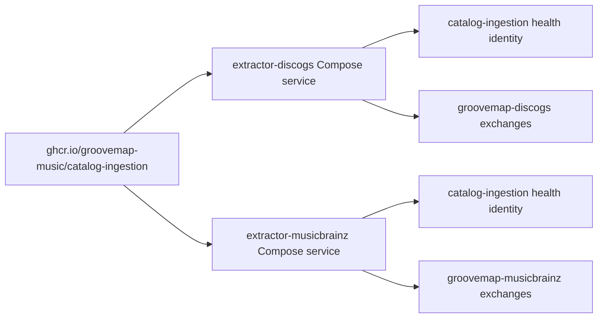

# Runtime identity and compatibility

The canonical service, repository, health-response, and container-image name is
`catalog-ingestion`. Runtime logs and the startup banner identify the service as
GrooveMap catalog ingestion, while source-specific messages distinguish Discogs from
MusicBrainz work.

## Retained compatibility identifiers

Some names are interfaces rather than product branding and remain unchanged:

| Identifier | Boundary | Reason retained |
| --- | --- | --- |
| `extractor` | Cargo package, executable, and container entrypoint | Renaming it would change build artifacts, local commands, and the image entrypoint without improving the published image identity. |
| `extractor-discogs`, `extractor-musicbrainz` | Deployment Compose service and network names | Deployment-side operations use these addressable runtime names. |
| `groovemap-discogs-*`, `groovemap-musicbrainz-*` | RabbitMQ exchange names | These are event wire contracts consumed by loaders and enrichers. The configured prefix remains overrideable. |
| Discogs and MusicBrainz field names | Catalog event payloads | Source-specific names describe upstream provenance and are not legacy product branding. |

The Docker user and Rust module names may also use `extractor` internally. They are
implementation details and do not define the repository, image, or user-facing service
identity.
