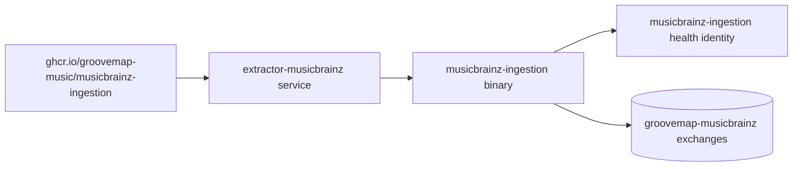

# Runtime identity and compatibility

The repository, package, executable, container image, health identity, startup banner,
and default OpenTelemetry service name all identify `musicbrainz-ingestion`. The Rust
library crate retains the internal name `extractor`. The deployment Compose service
remains `extractor-musicbrainz`, an addressable deployment interface.

## Retained compatibility identifiers

| Identifier | Boundary | Reason retained |
| --- | --- | --- |
| `extractor` | Rust library crate and internal module paths | Existing Rust imports and tests use this implementation name; it is not the executable or image identity. |
| `extractor-musicbrainz` | Deployment Compose service and network name | Deployment operations address the container by this stable service name. |
| `groovemap-musicbrainz-*` | RabbitMQ exchange names | These names are wire contracts consumed by MusicBrainz loaders and enrichers; the prefix remains configurable. |
| Discogs cross-reference fields | MusicBrainz event payloads | These fields record relationships declared by MusicBrainz data and do not select or invoke a Discogs producer. |

The independent Discogs producer has its own repository, image, process, state, and
release lifecycle.

## Cross-source boundary evidence

The provider split was rechecked at baseline revision
`d6aad4f304bc0d4e048cf7b3a349cb75c9eaa4c5`. The compatibility review covered call
sites, serialization, the Rust library surface, fixtures, and organization-owned
downstreams:

- repository-wide call-site searches found `Source`, `DataType::discogs`,
  `PoliteConfig::discogs`, and the Discogs state-marker path constructor only in their
  definitions and self-tests, never in the binary path;
- `Source` was not part of the versioned event schema, generated binding, configuration,
  state marker, health response, or command-line interface;
- the Cargo package has `publish = false`, and no other GrooveMap Cargo manifest or lock
  consumes `musicbrainz-ingestion` as a library dependency;
- Discogs-named media fixtures and payload fields are retained taxonomy and
  cross-reference conformance cases: they describe relationships present in MusicBrainz
  records and never start or contact the Discogs producer; and
- the event contract, exchange prefix, completion messages, and MusicBrainz state-marker
  path remain covered by the normal contract and runtime test gates.

That evidence supports removing the unused provider selector, Discogs-only type-list
constructor, Discogs HTTP defaults, Discogs marker path, and Discogs filename parser.
`scripts/check-repository.py` prevents those dormant entry points and retired lifecycle
wording from returning.

### Explicit compatibility exception

`DataType::Masters` and `ExtractionProgress.masters` remain even though Masters is not a
MusicBrainz entity. The zero-valued `masters` member already appears in the serialized
state, `/health`, and JSON `/metrics` shapes observed by operators. Removing it would
change those public bytes. Active extraction continues to use `DataType::musicbrainz()`,
which excludes Masters, and regression tests require the retained field while proving it
cannot enter the active MusicBrainz entity list.
