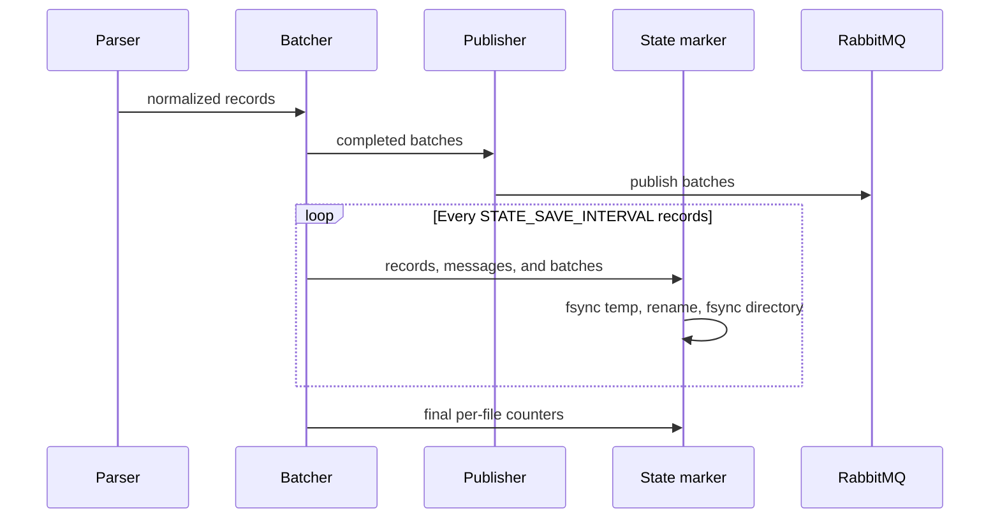

# Periodic state-marker checkpoints

The extractor saves per-file progress while a file is being processed. The default
interval is 5,000 records and can be changed with `STATE_SAVE_INTERVAL`; values below
one are clamped to one.



## What a checkpoint records

For the current file, a checkpoint updates:

- `records_extracted`
- `messages_published`
- `batches_sent`
- `last_updated`

Checkpoint write failures are logged as warnings and do not stop the data pipeline. The
extractor also writes the marker at phase transitions and file completion; those
orchestration writes may be required for the run to complete successfully.

## Recovery guarantee

The restart boundary is the file, not an offset within the file:

- Files marked `completed` are skipped on restart.
- A file left `in_progress` is parsed and published again from its beginning.
- The periodic count shows recent progress and limits how stale operational reporting
  can become, but it is not a seek position.

Consumers therefore must preserve the event contract's idempotent processing semantics.
Do not infer exactly-once delivery from a checkpoint count.

## Monitoring

Inspect a marker in the configured MusicBrainz data root:

```bash
jq '.processing_phase.current_file,
    .processing_phase.progress_by_file' \
  /musicbrainz-data/20260326-001001/.mb_extraction_status_20260326-001001.json
```

Markers live in the version directory and use the `.mb_extraction_status_<version>.json`
filename. They are runtime data and must not be committed to this repository.

See [State-marker system](state-marker-system.md) for version decisions, checksum
invalidation, and file locations.
