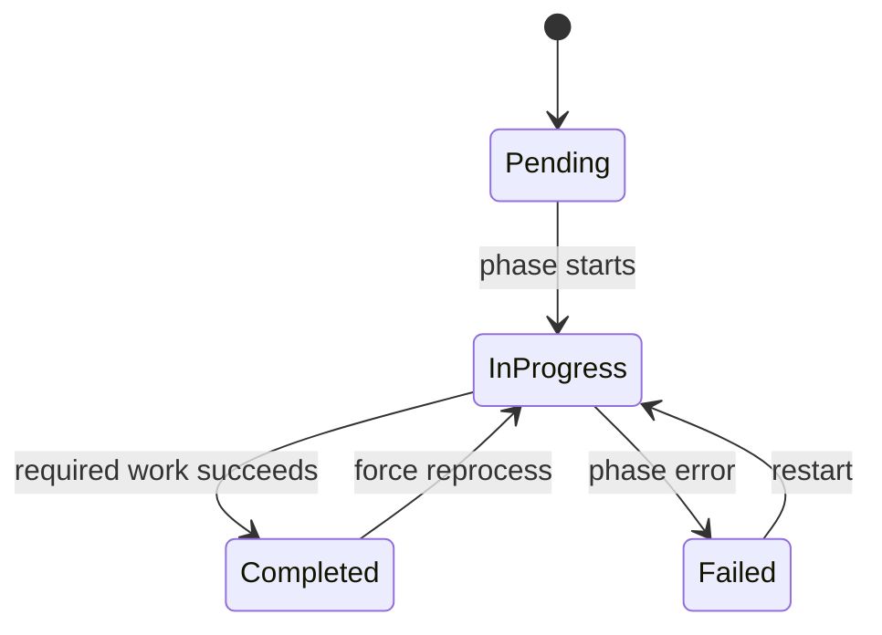

# MusicBrainz state-marker system

For version `20260326-001001`, the marker lives at
`{MUSICBRAINZ_ROOT}/20260326-001001/.mb_extraction_status_20260326-001001.json`.
It records `download_phase`, `processing_phase`, `publishing_phase`, and `summary`;
statuses are `pending`, `in_progress`, `completed`, or `failed`.

## Restart decisions

| Action | Trigger | Behavior |
| --- | --- | --- |
| Fresh run | Forced run, no marker, or unreadable marker | Build a fresh marker and process all four entity files. |
| Reprocess | Download failed or was interrupted before any file completed | Replace the loaded marker; the downloader verifies and repairs local files before processing. |
| Continue | Processing is pending, in progress, or failed, or download was interrupted after a file completed | Skip completed files and process every other file from its beginning. |
| Skip | The version summary is completed | Publish nothing and wait for the next check or trigger. |

Resume is file-granular. An `in_progress` file is republished from record one; periodic
counts are operational checkpoints, not parser offsets. See [Periodic state-marker
checkpoints](state-marker-periodic-updates.md).

## Provenance and durable writes

`download_phase.downloads_by_file[file].checksum` identifies verified local bytes.
`processing_phase.progress_by_file[file].source_checksum` identifies the bytes used by a
processing attempt. If verified bytes change for the same filename, completed processing
for that file is invalidated and re-queued. Older markers without provenance remain
loadable and are not invalidated speculatively.

Saves write and synchronize a temporary sibling, atomically rename it, and then attempt
to synchronize the parent directory. A corrupt or unreadable marker is logged and treated
as absent. Markers are runtime state in the mounted MusicBrainz root and must not be
committed.

## Completion signals

A file is marked complete only after its `file_complete` event is accepted by RabbitMQ.
The version is marked complete only after `extraction_complete` is accepted for all four
MusicBrainz exchanges. A restart therefore cannot skip a completion signal that was never
delivered.
